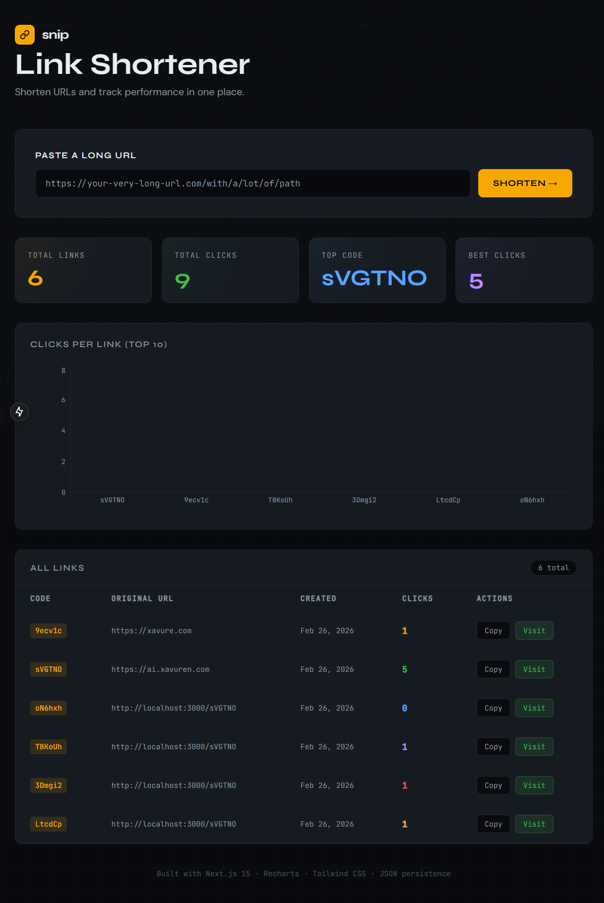

# Snip — Link Shortener with Analytics Dashboard

A full-stack link shortener built with **Next.js 15**, featuring a live analytics dashboard, persistent JSON storage, Recharts visualizations, and a dark editorial UI with Tailwind CSS.



---

## Table of Contents

1. [Project Overview](#project-overview)
2. [Tech Stack](#tech-stack)
3. [Project Structure](#project-structure)
4. [Architecture & Design Decisions](#architecture--design-decisions)
5. [API Reference](#api-reference)
6. [Data Model](#data-model)
7. [Frontend Components](#frontend-components)
8. [Persistence Layer](#persistence-layer)
9. [UI & Design System](#ui--design-system)
10. [Getting Started](#getting-started)
11. [How It Works — Step by Step](#how-it-works--step-by-step)
12. [Extending the Project](#extending-the-project)

---

## Project Overview

Snip is a self-contained link shortening service where the frontend and backend live inside a single Next.js 15 application. Users can:

- Paste any long URL and generate a unique 6-character alphanumeric short code
- Copy the shortened link to the clipboard instantly
- Simulate a "visit" to increment the click counter
- View all created links in a sortable analytics table
- Visualize click distribution across links in a bar chart
- See summary stats (total links, total clicks, top performing link)

All data is stored on disk in a plain `data/links.json` file — no database required.

---

## Tech Stack

| Layer       | Technology             | Purpose                                  |
|-------------|------------------------|------------------------------------------|
| Framework   | Next.js 15 (App Router) | Server + client in one project          |
| Language    | TypeScript             | Type safety across API and UI            |
| Styling     | Tailwind CSS v3        | Utility-first responsive design          |
| Charts      | Recharts 2             | Bar chart for click analytics            |
| Persistence | Node.js `fs` module    | Read/write JSON file on the server       |
| Fonts       | Google Fonts           | Syne (display), DM Sans (body), JetBrains Mono (code) |

---

## Project Structure

```
link-shortener/
├── data/
│   └── links.json              # Persistent storage — auto-created on first run
├── src/
│   ├── app/
│   │   ├── api/
│   │   │   └── links/
│   │   │       ├── route.ts            # GET /api/links, POST /api/links
│   │   │       └── [code]/
│   │   │           └── route.ts        # GET /api/links/:code, PATCH /api/links/:code
│   │   ├── globals.css                 # Global styles, fonts, animations
│   │   ├── layout.tsx                  # Root HTML shell with metadata
│   │   └── page.tsx                    # Main dashboard (single React component)
│   └── lib/
│       └── store.ts                    # Data access layer — all file I/O here
├── next.config.js
├── tailwind.config.js
├── postcss.config.json
├── tsconfig.json
├── package.json
└── README.md
```

---

## Architecture & Design Decisions

### Why Next.js 15 App Router?

Next.js 15 with the App Router allows us to co-locate API Route Handlers with the React frontend in one repository and one `npm run dev` command. There is no need for a separate Express server, CORS setup, or proxy configuration — the same process serves both.

### Why JSON file storage instead of a database?

For a self-contained demonstration project, a plain JSON file on disk eliminates external dependencies entirely. The `fs` module is synchronous and sufficient for low-concurrency usage. The `data/` directory and `links.json` file are created automatically on first run if they do not exist.

### Why a single page component?

The entire dashboard is one React component in `src/app/page.tsx`. This is intentional for simplicity and portability — the full feature set is visible and auditable in one place without navigating a deep component tree.

### Client-side state management

All state lives in `useState` hooks within the page component. Data is fetched from the API on mount and optimistically updated after mutations. No global state library is needed at this scale.

---

## API Reference

All endpoints live under `/api/links` and are implemented as Next.js Route Handlers using the Web Request/Response API.

---

### `GET /api/links`

Returns all shortened links sorted by insertion order (newest first as pushed to front).

**Request:** No body required.

**Response `200 OK`:**
```json
{
  "links": [
    {
      "code": "aB3xYz",
      "originalUrl": "https://example.com/some/long/path",
      "createdAt": "2024-01-15T10:30:00.000Z",
      "clicks": 4
    }
  ]
}
```

---

### `POST /api/links`

Creates a new shortened link.

**Request body:**
```json
{
  "url": "https://example.com/some/long/path"
}
```

**Behavior:**
- If the URL is missing the `https://` or `http://` prefix, `https://` is prepended automatically.
- The URL is validated using the native `URL` constructor. Invalid URLs return a 400 error.
- A unique 6-character alphanumeric code is generated (collision-safe by re-rolling on conflict).

**Response `201 Created`:**
```json
{
  "link": {
    "code": "aB3xYz",
    "originalUrl": "https://example.com/some/long/path",
    "createdAt": "2024-01-15T10:30:00.000Z",
    "clicks": 0
  }
}
```

**Error responses:**

| Status | Body                          | Cause                    |
|--------|-------------------------------|--------------------------|
| `400`  | `{ "error": "URL is required" }` | Missing or non-string `url` field |
| `400`  | `{ "error": "Invalid URL" }`    | URL fails `new URL()` parsing |

---

### `GET /api/links/:code`

Retrieves a single link record by its short code.

**Response `200 OK`:**
```json
{
  "link": { ... }
}
```

**Response `404 Not Found`:**
```json
{
  "error": "Link not found"
}
```

---

### `PATCH /api/links/:code`

Increments the `clicks` counter for the specified link by 1. This simulates a visit to the short URL.

**Request:** No body required.

**Response `200 OK`:**
```json
{
  "link": {
    "code": "aB3xYz",
    "originalUrl": "https://example.com/some/long/path",
    "createdAt": "2024-01-15T10:30:00.000Z",
    "clicks": 5
  }
}
```

**Response `404 Not Found`:**
```json
{
  "error": "Link not found"
}
```

---

## Data Model

Each link is stored as an object conforming to the `LinkRecord` interface defined in `src/lib/store.ts`:

```typescript
interface LinkRecord {
  code: string;       // 6-character alphanumeric identifier, e.g. "aB3xYz"
  originalUrl: string; // The full destination URL
  createdAt: string;  // ISO 8601 timestamp from new Date().toISOString()
  clicks: number;     // Integer count of simulated visits
}
```

The data file at `data/links.json` is an array of these records:

```json
[
  {
    "code": "aB3xYz",
    "originalUrl": "https://github.com/vercel/next.js",
    "createdAt": "2024-01-15T10:30:00.000Z",
    "clicks": 12
  },
  {
    "code": "Qr7mNp",
    "originalUrl": "https://tailwindcss.com/docs",
    "createdAt": "2024-01-15T11:00:00.000Z",
    "clicks": 3
  }
]
```

---

## Frontend Components

All UI lives in `src/app/page.tsx` as a single `"use client"` component with several inline sub-components.

### `DashboardPage` (default export)

The root component. Manages all application state via `useState`:

| State variable   | Type                  | Purpose                                         |
|------------------|-----------------------|-------------------------------------------------|
| `links`          | `LinkRecord[]`        | Master list of all links, fetched from API      |
| `inputUrl`       | `string`              | Controlled input value for the URL text field   |
| `isCreating`     | `boolean`             | Disables the Shorten button during API call     |
| `newLink`        | `LinkRecord \| null`  | The most recently created link, shown in result box |
| `error`          | `string`              | Validation or network error message             |
| `tooltip`        | `TooltipState \| null` | Tracks which cell shows "Copied!" confirmation |
| `visitingCode`   | `string \| null`      | Disables Visit button while PATCH is in flight  |
| `activeBar`      | `string \| null`      | Tracks hovered bar in chart for dim effect      |

Key handlers:

- **`handleShorten()`** — Validates input, calls `POST /api/links`, prepends new link to state list, and stores it in `newLink` for the result panel.
- **`handleVisit(code)`** — Calls `PATCH /api/links/:code` and merges the updated record into both `links` and `newLink` state.
- **`copyToClipboard(code)`** — Writes `${HOST}/${code}` to the clipboard and temporarily sets tooltip state for visual confirmation.
- **`fetchLinks()`** — Wrapped in `useCallback`, called on mount via `useEffect` to hydrate the links list.

### `StatCard`

A summary stat widget displaying a label and large numeric/text value with a per-card accent color and radial gradient glow.

```
Props:
  label: string     — Small uppercase label
  value: string | number — Primary displayed value
  accent: string    — CSS color for text and glow
  delay: string     — CSS animation-delay for staggered entrance
```

### `CustomTooltipContent`

A Recharts-compatible custom tooltip rendered when hovering over a bar. Shows the short code and click count with panel styling matching the overall dark theme.

---

## Persistence Layer

All file I/O is centralized in `src/lib/store.ts`. This module runs exclusively on the server (inside API Route Handlers) and must never be imported in client components.

### Functions

#### `readLinks(): LinkRecord[]`
Reads and parses `data/links.json`. Calls `ensureDataFile()` first to guarantee the file exists.

#### `writeLinks(links: LinkRecord[]): void`
Serializes the entire links array and overwrites `data/links.json` with 2-space indentation for human readability.

#### `findLink(code: string): LinkRecord | undefined`
Returns the first record matching the given code, or `undefined`.

#### `createLink(originalUrl: string): LinkRecord`
Generates a collision-safe code via `generateCode()`, constructs a new `LinkRecord` with `clicks: 0` and the current timestamp, appends it to the array, writes it to disk, and returns the new record.

#### `incrementClicks(code: string): LinkRecord | null`
Finds the record by index, increments `clicks` in place, writes the updated array, and returns the mutated record. Returns `null` if the code is not found.

#### `generateCode(existingCodes: string[]): string` (internal)
Randomly samples 6 characters from the 62-character alphanumeric alphabet (`a-z`, `A-Z`, `0-9`) in a `do-while` loop until a code not present in `existingCodes` is produced. This ensures uniqueness even as the dataset grows.

---

## UI & Design System

The design follows a **dark editorial / developer tool** aesthetic inspired by GitHub's dark theme but pushed further with amber accents and geometric grid backgrounds.

### Color Palette

| Token         | Hex       | Usage                              |
|---------------|-----------|------------------------------------|
| `void`        | `#080a0e` | Page background                    |
| `surface`     | `#0d1117` | Input backgrounds                  |
| `panel`       | `#161b22` | Card and table backgrounds         |
| `border`      | `#21262d` | All dividers and outlines          |
| `muted`       | `#8b949e` | Secondary text, labels, placeholders|
| `text`        | `#e6edf3` | Primary body text                  |
| `accent`      | `#f7a800` | Brand color — CTA, codes, highlights|
| `emerald`     | `#3fb950` | Visit/success actions              |
| `crimson`     | `#f85149` | Errors                             |
| `azure`       | `#58a6ff` | Stat card accent                   |
| `violet`      | `#bc8cff` | Stat card accent                   |

### Typography

- **Syne** (display, weights 400–800) — Used for headings, labels, button text. Geometric and distinctive.
- **DM Sans** (body, weights 300–500) — Used for body copy and descriptions. Clean and legible.
- **JetBrains Mono** (monospace) — Used for codes, URLs, timestamps, axis labels. Instantly signals technical content.

### Animations

- `fadeInUp` — Applied via `.fade-in-up` class with staggered `animation-delay` on each section for a smooth load sequence.
- `shimmer` — Used on loading states.
- `grid-bg` — CSS `background-image` grid overlay providing subtle depth to the page background.
- `noise-overlay` — SVG fractal noise texture applied as a `::before` pseudo-element on the body for a fine grain texture.

### Bar Chart Colors

Bars cycle through six distinct colors: amber, green, blue, violet, red, orange — ensuring visual distinction between links even when many are present.

---

## Getting Started

### Prerequisites

- Node.js 18.17 or later
- npm 9+ (or yarn/pnpm)

### Installation

```bash
# 1. Navigate into the project
cd link-shortener

# 2. Install all dependencies
npm install

# 3. Start the development server
npm run dev
```

Open [http://localhost:3000](http://localhost:3000) in your browser.

The `data/links.json` file is created automatically on the first API call. You do not need to create it manually.

### Production Build

```bash
npm run build
npm run start
```

The production build outputs to `.next/`. Data continues to be read from and written to `data/links.json` relative to `process.cwd()`.

---

## How It Works — Step by Step

### Shortening a URL

1. User types or pastes a URL into the input field.
2. On clicking "Shorten →" (or pressing Enter), `handleShorten()` is called.
3. The function validates that the input is not empty, then sends `POST /api/links` with `{ url }`.
4. The API Route Handler in `src/app/api/links/route.ts` normalizes the URL (adds `https://` if absent) and validates it with `new URL()`.
5. `createLink()` in `src/lib/store.ts` reads `links.json`, generates a unique 6-char code, appends the new record, writes the file, and returns the record.
6. The API responds with `201` and the new link object.
7. The client stores it in `newLink` state (showing the result banner) and prepends it to the `links` array (updating the table and chart immediately).

### Visiting a Link

1. User clicks "Visit" next to any link in the result banner or the table row.
2. `handleVisit(code)` sends `PATCH /api/links/:code`.
3. The Route Handler in `src/app/api/links/[code]/route.ts` calls `incrementClicks(code)`.
4. `incrementClicks` finds the record by code, increments `clicks`, writes the file, and returns the updated record.
5. The client receives the updated record and replaces it in the `links` array and (if applicable) in `newLink` state — the click count updates instantly across the table and chart.

### Persisting Data

Every write operation calls `writeLinks()` which does a full overwrite of `data/links.json`. This is safe for single-process, low-concurrency usage. For high-traffic production use, this should be replaced with a proper database (PostgreSQL, SQLite via Prisma, etc.).

---

## Extending the Project

### Add Real Redirects

Create a dynamic catch-all route at `src/app/[code]/route.ts`:

```typescript
import { NextRequest, NextResponse } from "next/server";
import { incrementClicks, findLink } from "@/lib/store";

export async function GET(
  _req: NextRequest,
  { params }: { params: Promise<{ code: string }> }
) {
  const { code } = await params;
  const link = findLink(code);
  if (!link) return NextResponse.redirect(new URL("/", _req.url));
  incrementClicks(code);
  return NextResponse.redirect(link.originalUrl);
}
```

### Replace JSON with a Database

Swap `src/lib/store.ts` for a Prisma client or a better-sqlite3 implementation. The API routes and frontend component require zero changes since they only call the store functions.

### Add QR Code Generation

Install `qrcode` and generate a QR code data URL server-side after creating each link. Store the QR data in the `LinkRecord` and display it in the result panel.

### Add Delete Functionality

Add a `DELETE /api/links/:code` endpoint that filters the code out of the array and writes the file. Add a delete button in the table row.

### Add Sorting and Filtering

The `links` array in state can be sorted client-side before rendering. Add `sortBy` state (`"date"` | `"clicks"`) and a `filterText` state to filter by URL substring.

### Add Authentication

Wrap the API routes with session checking using `next-auth` or a custom middleware in `src/middleware.ts`. Gate the dashboard page with a login check using Next.js `redirect()` in the Server Component layer.
